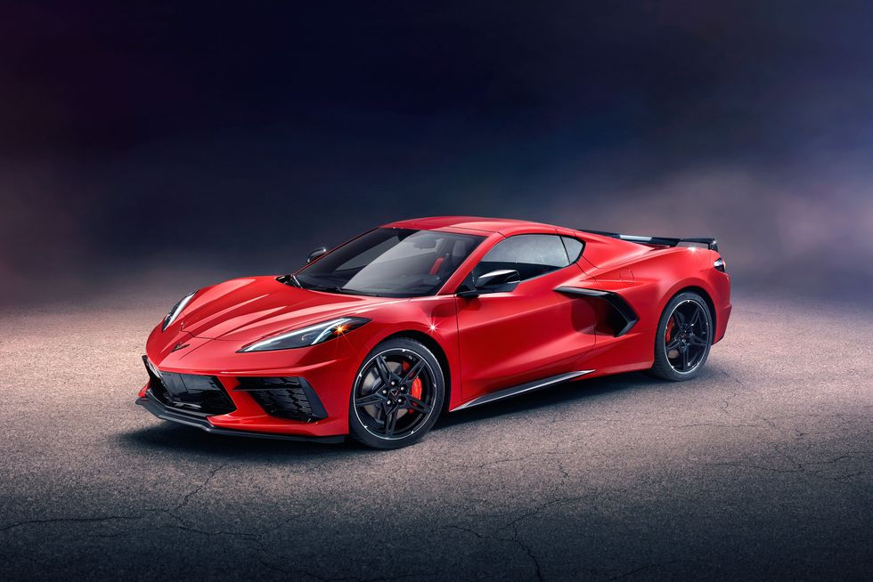
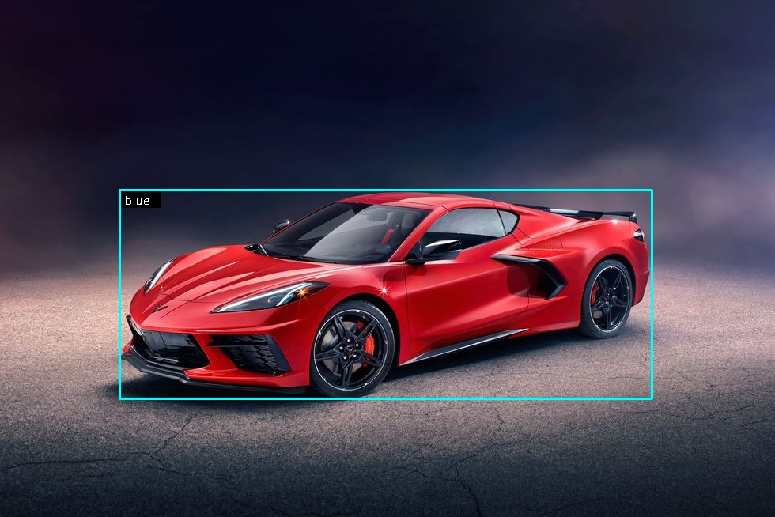
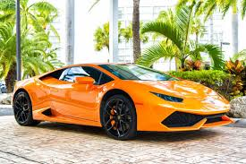
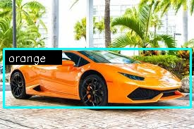

# 🚗 Car Color Detection using CNN

This project aims to classify the color of cars from images using a custom Convolutional Neural Network (CNN). The model is trained on a manually curated and web-scraped dataset, optimized with various regularization and augmentation techniques. A Streamlit-based web app is also developed for interactive predictions.

This project was completed as part of a virtual internship. The goal was to build a model to analyze traffic signals, detect cars, people, and other vehicles, and provide specific visualizations and counts according to the internship requirements.


## 🔗 Live Demo
👉 [Streamlit App](https://car-color-detection.streamlit.app/)  
👉 [Kaggle Notebook](https://www.kaggle.com/code/jayantkathuria/car-color-detect)

---

## 📌 Features
- Custom CNN architecture built using TensorFlow & Keras
- Image data collected manually and via web scraping
- Data augmentation and class balancing techniques
- Callbacks (EarlyStopping, ModelCheckpoint, ReduceLROnPlateau) for optimized training
- Achieved **82% accuracy** on test set
- Streamlit app for real-time car color prediction

---

## **Project Overview**

The system performs the following tasks:

1. **Car Detection and Color Prediction**  
   - Detects cars at the traffic signal.  
   - Predicts car color (red, blue, etc.).  
   - **Internship-specific modification:** `red cars are shown as blue and blue cars as red` in the output visualization.  

2. **Car Counting**  
   - Counts the number of cars present at the traffic signal.

3. **People Detection and Gender Prediction**  
   - Detects people in the traffic signal.  
   - Predicts the number of males and females.

4. **Other Vehicle Detection and Counting**  
   - Detects vehicles other than cars (e.g., buses, trucks, bikes).  
   - Counts how many other vehicles are present.

---

## 🗂️ Dataset
The dataset consists of car images across multiple color classes (e.g., Red, Blue, White, etc.). Due to imbalance in color categories, class weights and augmentation techniques were applied.
👉 [Checkout Dataset on Kaggle](https://www.kaggle.com/datasets/jayantkathuria/car-color-dataset)

**Setup**

Run:

```bash
python download_data.py
```

---

## 🧠 Model Architecture
The models used include:
- Pre-trained models (Haarcascade, SSD MobileNet)
- Custom trained model (`my_custom_model_v1.h5`) from a previous project
- Custom CNN model which includes
   - Multiple `Conv2D` layers with ReLU activation
   - `MaxPooling2D` layers to reduce spatial dimensions
   - `Dropout` and `L2 regularization` to avoid overfitting
   - Fully connected `Dense` layers
   - Final `Softmax` layer for multi-class classification

---

## 🛠️ How to Run Locally

1. **Clone the repository**
   ```bash
   git clone https://github.com/jayantkathuria7/car-color-detection.git
   cd car-color-detection
   ```


2. **Install requirements**

   ```bash
   pip install -r requirements.txt
   ```

3. **Run the Streamlit app**

   ```bash
   streamlit run app.py
   ```

---

## Sample Outputs
| Input Image | Predicted Output |
|------------|----------------|
|  |  |
|  |  |
`Note:` In first sample image, a red car is predicted blue as per the [task requirements](#project-overview)


## 📊 Results

* Accuracy: **82%** on test data
* Evaluation metrics: Classification report & confusion matrix
* Successfully handles real-world car images with varying backgrounds and lighting

---

## 📁 Repository Structure

```
├── app.py               # Streamlit app
├── scripts/
   ├── download_data.py     # Python script to download dataset
   ├── generate_outputs.py  # Python script to genrate outputs for some samples test images in assets/test/input 
├── artifacts/
   ├── models/               # trained models
      ├── Car_Color_Detection.keras
      ├── Age_Sex_Detection.keras
   ├── history/
      ├── model_history.json    # Contains model training history
   ├── plots
      ├── class_distribution.png
      ├── confusion_matrix.png
      ├── model_accuracy_vs_epochs.png
      ├── model_loss_vs_epochs.png
   ├── classification_report.json          # classificaion report of the model
├── assets/
   ├── demo.mp4
   ├── demo.gif
   ├── project_notes.md
   ├── test/
      ├── input
         ├── sample_video1.mp4
         ├── sample_video2.mp4
         ├── sample_image1.jpg
         ├── sample_image2.jpg
         ├── sample_image3.jpg
      ├── output
         ├── sample_video1_out.mp4
         ├── sample_video2_out.mp4
         ├── sample_image1_out.jpg
         ├── sample_image2_out.jpg
         ├── sample_image3_out.jpg
├── requirements.txt     # Python dependencies
├── models/               # Pre-trained models
   ├── haarcascade_frontalface_default.xml
   ├── ssd_mobilenet_v2_coco_2018_03_29.pbtxt
   ├── ssd_mobilenet_v2_coco_2018_03_29
      ├── frozen_inference_graph.pb
├── utils/                # helper module
   ├── __init__.py            # make it a Python package
   ├── annotations.py         # functions to display car and face annotations
   ├── face_detection.py      # functions to detect and analyze faces
   ├── image_processing.py    # functions to preprocess images
   ├── model_loader.py        # functions for loading models
   ├── vehicle_detection.py   # functions to detect and analyze cars
├── notebooks/ 
   ├── car-color-detect.ipynb           # jupyter notebook showing training of neural network
```

---

## 🤝 Contributions & Acknowledgements

This project was completed as part of a hands-on deep learning exercise. 

---

## 📬 Connect

Feel free to connect or reach out:

* GitHub: [jayantkathuria7](https://github.com/jayantkathuria7)
* LinkedIn: [Jayant Kathuria](https://www.linkedin.com/in/jayantkathuria7)
